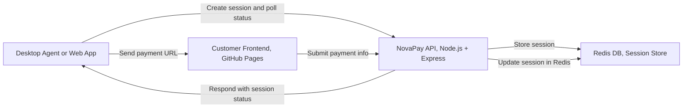
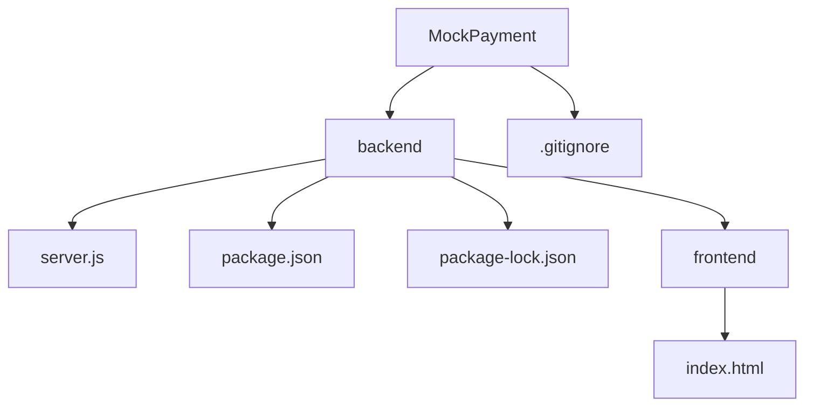
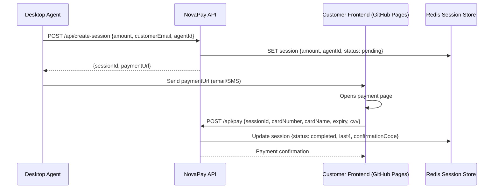
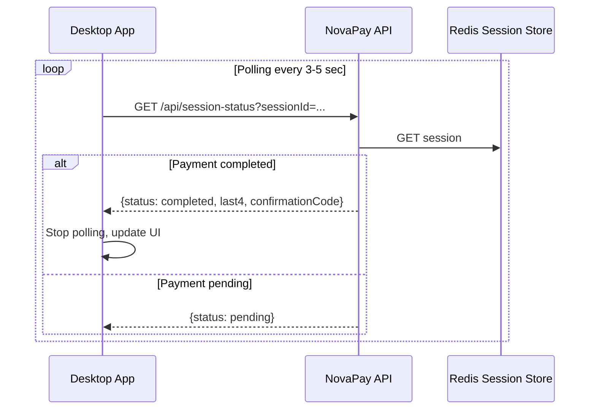

# NovaPay Mock Payment Service

## Introduction

**NovaPay** is a mock payment service designed for developer testing and integration purposes. It provides a simple, secure payment flow where an agent can generate a payment session, share a frontend URL with a customer, and confirm the payment. The service stores session data in Redis and allows polling from a desktop or web application to verify payment completion.

This repository contains the backend service, frontend, and instructions to deploy on GitHub Pages and Render.

---

## Architecture Overview



**Key Components:**

- **Desktop Agent / Web App:** Calls `create-session` and polls `session-status` for payment confirmation.
- **Backend (Render NovaPay Service):** Node.js + Express, stores sessions in Redis.
- **Redis:** Persistent storage for sessions and payment status.
- **Frontend (GitHub Pages):** Customer-facing payment page prepopulated with `amount` and `sessionId`.

---

## Project File Structure



**Explanation:**

- MockPayment/ – Root repository folder on GitHub.
  * .gitignore – Ignored files for Git (e.g., node_modules/).
  - backend/ – Node.js backend folder containing:
    - server.js – Main Express server with Redis and polling.
    - package.json – NPM dependencies and scripts.
    - package-lock.json – Locked versions for reproducibility.
    - frontend/ – Static frontend folder:
      - index.html – Payment page.


---

## Setup and Deployment

### 1. Backend (Render)

1. Create a **Web Service** in Render: `NovaPay`
2. Connect GitHub repository `MockPayment`
3. Environment Variables:
   - `REDIS_URL` → Redis connection string (from Render Key-Value service)
   - `FRONTEND_URL` → `https://jucorralg.github.io/MockPayment/backend/frontend`
4. Build Command: `npm install`
5. Start Command: `node server.js`
6. Expose port: default `3000`

---

### 2. Frontend (GitHub Pages)

1. Push `backend/frontend/index.html` to your GitHub repository
2. Enable GitHub Pages from the repository settings
3. URL will be:  
   `https://jucorralg.github.io/MockPayment/backend/frontend/index.html`

---

### 3. Redis (Render Key-Value)

1. Create a Key-Value service `Novapay-redis`
2. Use URL: `redis://red-d6bcjbggjchc73ahno00:6379`
3. Assign this URL to the `REDIS_URL` environment variable in the Render web service

---
## Flow Diagrams

### 1. Payment Session and Customer Payment



### 2. Desktop Agent Polling for Payment Status


## APIs

### 1. Create Payment Session

**Endpoint:** `POST /api/create-session`  
**Request Body:**

```json
{
  "amount": 100.50,
  "customerEmail": "customer@example.com",
  "agentId": "agent-123"
}
```

**Response:**
```json
{
  "sessionId": "bf84e195-1137-4c41-a314-deef150bb5ba",
  "paymentUrl": "https://jucorralg.github.io/MockPayment/backend/frontend/index.html?sessionId=bf84e195-1137-4c41-a314-deef150bb5ba&amount=100.50"
}
```

### 2. Process Payment

**Endpoint:** `POST /api/pay`

**Request Body:**
```json

{
  "sessionId": "bf84e195-1137-4c41-a314-deef150bb5ba",
  "cardNumber": "4111111111111111",
  "cardName": "John Doe",
  "expiry": "12/26",
  "cvv": "123"
}
```

**Response:**
```json
{
  "status": "success",
  "amount": 100.5,
  "last4": "1111",
  "confirmationCode": "NP-AB12CD34"
}
```
### 3. Poll Session Status

**Endpoint:** `GET /api/session-status?sessionId=<sessionId>`

**Response:**
```json
{
  "agentId": "agent-123",
  "customerEmail": "customer@example.com",
  "amount": 100.5,
  "status": "completed",
  "last4": "1111",
  "confirmationCode": "NP-AB12CD34"
}
```

Polling Notes: Desktop apps should poll this endpoint periodically (e.g., every 3–5 seconds) to detect payment completion. 

### Desktop Agent Polling Example 

You can integrate the polling mechanism in a desktop application using the following JavaScript snippet (not tested):

```javascript
const sessionId = 'bf84e195-1137-4c41-a314-deef150bb5ba'; // session created via create-session
const pollInterval = 3000; // 3 seconds
let poller;

function startPolling() {
  poller = setInterval(async () => {
    try {
      const response = await fetch(`https://novapay-2590.onrender.com/api/session-status?sessionId=${sessionId}`);
      const data = await response.json();

      if (data.status === 'completed') {
        console.log('✅ Payment completed:', data);
        clearInterval(poller); // stop polling
      } else {
        console.log('⏳ Payment pending...');
      }
    } catch (err) {
      console.error('Error polling session status:', err);
    }
  }, pollInterval);
}

function stopPolling() {
  clearInterval(poller);
}

// Start polling
startPolling();

```
Notes:

- Replace sessionId dynamically when a new session is created.
- stopPolling() can be called to cancel the polling manually.
---
## Testing

1. Start backend: node server.js

2. Test POST /api/create-session using Postman

3. Open the returned paymentUrl in a browser, enter card details

4. Test POST /api/pay via frontend or Postman

5. Poll GET /api/session-status to confirm payment
---

## Troubleshooting

- **Invalid Session:** Ensure sessionId exists in Redis and matches the URL.

- **Backend Not Responding:** Check that REDIS_URL and FRONTEND_URL environment variables are set correctly.

- **Port Conflicts:** Ensure no other service is using port 3000 locally.

- **GitHub Pages URL:** Must match the FRONTEND_URL in Render.

